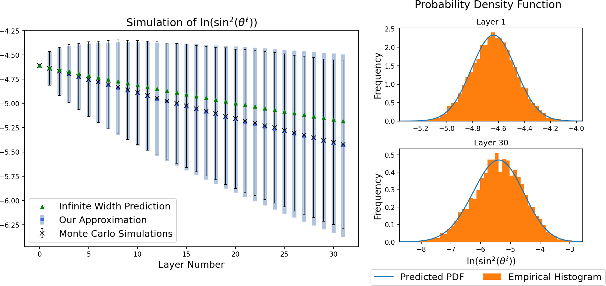
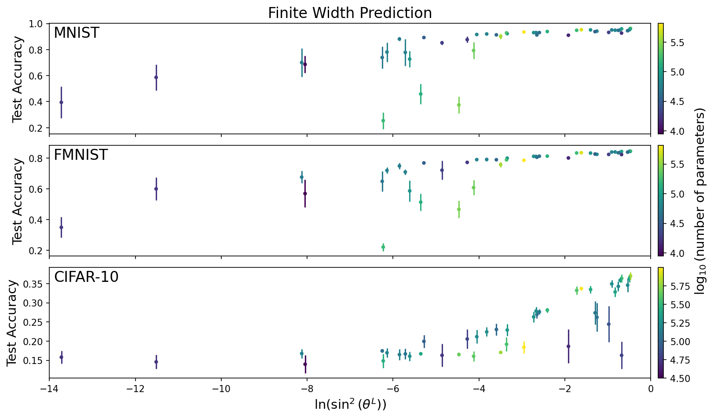

# Depth Degeneracy in Neural Networks
This repository contains the code used to produce the main figures in two papers I have worked on during my Master's degree. My research involves studying the "large depth degeneracy phenomenon" in neural networks, where inputs tend to get more correlated as they treavel through the layers of an initialized network. Networks which exhibit this type of degeneracy may have a hard time distinguishing between inputs, which can lead to poor training performance.

## Angle_Evolution
This folder contains a Google Colab notebook which produces the plots in Figure 1 of _Depth Degeneracy in Neural Networks: Vanishing Angles in Fully Connected ReLU Networks on Initialization_ (Jakub and Nica, 2023a), which can be found at the following [link](https://arxiv.org/abs/2302.09712). This paper was submitted to the Journal of Machine Learning Research. Figure 1 from our paper is shown below.

|  |
| :--: | 
| We feed 2 inputs with initial angle $\theta^0 = 0.1$ into 5000 Monte Carlo samples of independently initialized networks with network width $n_\ell = 256$ for all layers. Left: Using the Monte Carlo samples, we plot the empirical mean and standard deviation of $\ln(\sin^2(\theta^\ell))$ at each layer. We compare this to both the infinite width update rule and our prediction using Approximation 1 for the mean of $\ln(\sin^2(\theta^\ell))$. Our prediction for the standard deviation in each layer using Approximation 2 is also plotted as the shaded area. In contrast to our prediction, the infinite width rule predicts 0 variance in all layers. Right:  We plot histograms of our simulations as well as our predicted probability density function using Approximation 2 from (10) at Layer 1 (top) and Layer 30 (bottom). The predicted and empirical distribution are statistically indistinguishable according to a Kolmogorov-Smirnov test, with $p$ values $0.987 > 0.05$ (top) and $0.186  > 0.05$ (bottom). |

## Training_Performance
This folder contains shortened versions of the code used to produce Figure 1 of _Network Degeneracy as an Indicator of Training Performance: Comparing Finite and Infinite Width Angle Predictions_ (Jakub and Nica, 2023b), which can be found at the following [link](https://arxiv.org/abs/2306.01513). This paper was submitted to the 2023 International Conferece on Machine Learning for the High-Dimensional Learning Dynamics workshop. The code is split into 3 notebooks, one for each of the MNIST, Fasion-MNIST, and CIFAR-10 datasets. Optional code is inlcuded to save the results in order to plot all 3 datasets together, as in the figure below.

|  |
| :--: | 
| We compare 45 different network architectures trained on the MNIST, Fashion-MNIST, and CIFAR-10 datasets 10 times each. Using the architecture of the network and Algorithm 1, we predict the angle between 2 orthogonal inputs at the final output layer of the network on initialization. We express the angle as $\ln(\sin^2(\theta^L))$, to follow the form used when developing the finite width approximations. The angle is plotted against the accuracy of each network on the test data after training, with error bars representing a 95\% confidence interval across the 10 runs. All networks are trained using 1 epoch, batch size $=100$, categorical cross-entropy loss, the ADAM optimizer, and default learning rate in the Keras module of TensorFlow. See Appendix A.2 for details on all of the network architectures used. |

### References
Cameron Jakub and Mihai Nica. Depth degeneracy in neural networks: Vanishing angles in
fully connected ReLU networks on initialization, 2023a. URL https://arxiv.org/abs/2302.09712

Cameron Jakub and Mihai Nica. Network degeneracy as an indicator of training performance: Comparing finite and infinite width angle predictions, 2023b. URL https://arxiv.org/abs/2306.01513

